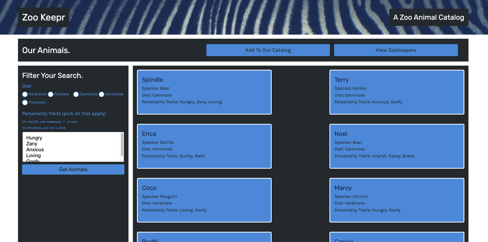

# zookeepr

## Description

A online catalog for a zoo, it allows animal enthusiasts to look up animals (_the current selection is limited_), create new animals by adding their species and personality traits as well as giving them a name

There is also a catalog for the zoo keepers them selves, which you can also add new zoo keepers too

## Usage

To start with, you will require Node.js, if you don't have it you can install it [here](https://nodejs.org/en/download/)

After opening the project, open up your command line and make sure you're in the root directory of the project, type `npm install` to install the dependencies, then type `npm start` in order to start it. In your command line you should "API server now on port 3001!" being printed out

Open up your browser and type `localhost:3001` in the address bar and this will bring you to where zookeepr is currently running

Now you can view either the animals or the zoo-keepers, or you can add to them by filling out the required fields and clicking "add animal" or "add zoo-keeper"

## Tests

Tests are done with jest

## Liscence

Not under any liscence

## Contributions

Made by Daniel Arzanipour

## Questions

[My Github](https://github.com/DanielArzani)

If you need to reach me for any additional questions, you can reach me at my [Gmail](mailto:daniel.arzanipour@gmail.com)
